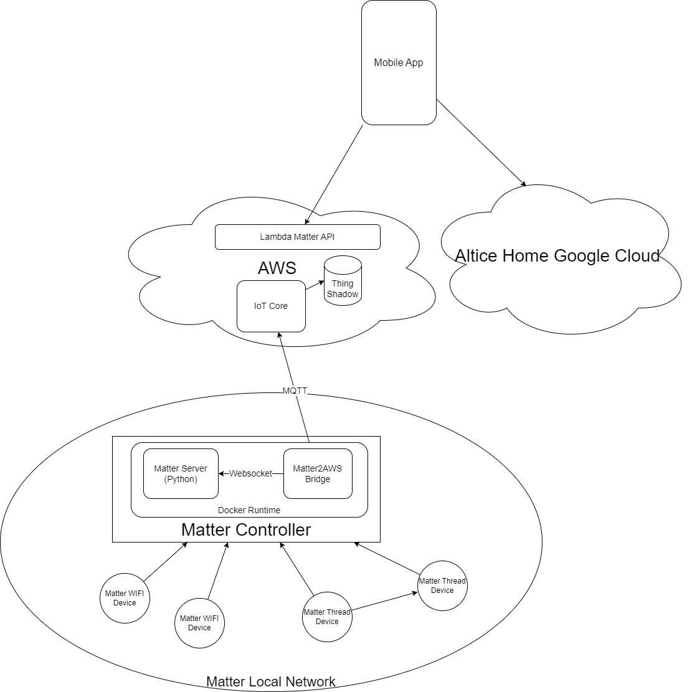

# Matter PoC Objetives

Check https://www.youtube.com/watch?v=PsNdR-m5pwE and try to show similar if possible with Tuya and EVE Matter devices. List devices to purchase. Show interoperability between Google Home and Homekit.

## Devices and Matter clusters

- WiFi Tuya devices (lights, plugs): check Tuya Cloud is not used
- Thread Tuya devices (motion, contact sensors): check Tuya Cloud is not used
- Nanoleaf Lights
- Eve Plug (Thread)
- Aqara P2 Contact Sensor (Thread)
- Switch Bot temperature / humidity sensor
- TP Link Tapo Switch
- ESP32 based devices
- Matter Controller @ Matter Hub (Dusun)
- Matter Controller @ FiberGW (Pi4 emulating FiberGW)

## Mobile App integration

Commissioning and control with Altice Home App

## Local control

Show local control, Mobile App directly interfaces with Matter Controller withou using Cloud back-end 

## Remote control

Show remote control with Altice Home

## Altice Home + Google Home multi-admin

**scenario 1** (nice to have)
- commissioning to Altice Fabric
- share to Google Home
- concurrent control with Altice Home & Google Home

**scenario 2**
- commissioning to Google Home 
- share to Altice Fabric
- concurrent control with Altice Home & Google Home

## Altice Home + Apple Home multi-admin

**scenario 1** (nice to have)
- commissioning to Altice Fabric
- share to Apple Home
- concurrent control with Altice Home & Apple Home

**scenario 2**
- commissioning to Apple Home 
- share to Altice Fabric
- concurrent control with Altice Home & Apple Home

## Altice Home + Home Assistant multi-admin

**scenario 1** (nice to have)
- commissioning to Altice Fabric
- share to Home Assistant
- concurrent control with Altice Home & Home Assistant

**scenario 2**
- commissioning to Home Assistant
- share to Altice Fabric
- concurrent control with Altice Home & Home Assistant

## Customer Care portal

Demo front-end https://developers.home-assistant.io/docs/frontend

## Security (nice to have)

Check if it is possible to demo this https://www.home-assistant.io/integrations/manual with zigbee devices and/or thread devices

## Voice Assistants (nice to have)

Google Assistant: https://www.home-assistant.io/integrations/google_assistant/

Alexa: https://www.home-assistant.io/integrations/alexa/
