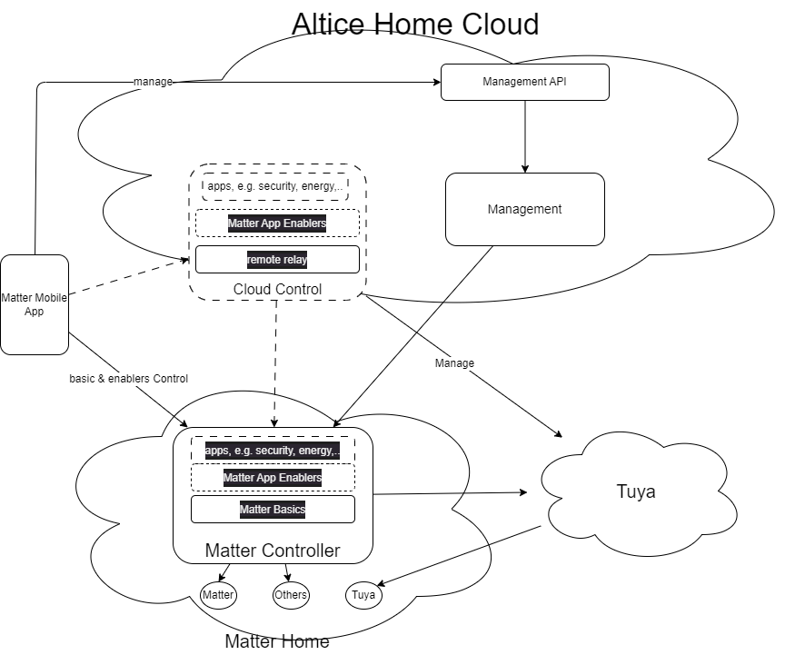

# Matter Architecture

## Target

- the Mobile App should use local interfaces when the mobile phone is connected to the local residential network 
- the API used in the local interface should be the same as the one used for remote control ie the mobile phone is not connected to the local residential network
- the management functionalities (e.g. user and services provisioning) should be as much as possible hosted in the cloud back-end
- the control functionalities (send commands to devices, status monitoring, devices events handling, apps, ..) should be as much as possible hosted in the local Matter network
- if the hosting device like the FiberHW has not enough computational resources, some controlling  functionalities are hosted in the Cloud - **enablers and apps** functionalities. Mandatory functionalities to be in the local host - **basic controller** - should provide Matter Controller autonomy to work without the Cloud for more frequent use cases. 
- The software components implementing controlling functionalities should be the same independently of the hosting device: FiberGW, MatterHub, Cloud Server
-  

**Open Questions**

- where to host the Admin features setting the ACLs?
- Mobile App as Matter node playing controller role overlapping with resident Matter Controller?
- Local control using native Matter primitives where Mobile would use different APIs for remote and local control?
- Transport protocol to be used for control:
  - WSS
  - MQTT
  - Others?

### Controlling functionalities

#### Matter Basics

- Matter devices registration
- Matter OTA
- Matter Stack (data model + interaction model...)
- Matter bridges
- ...

#### Matter App enablers

- Matter relay
- Automation
- Devices control
- Devices status monitoring
- Devices events handler
- Notifications eg push notification, email, SMS, ...
- Non-Matter integrations e.g. Tuya, Shelly, ...
- ...

### Applications

#### Mobile App functionalities

- Devices Commissioning
- Control UI
- Management UI
- ...

#### Automation / Scenarios

- sensor triggers
- scheduller trigger
- commands to actuators
- persistence
- creation
- update
- removal
- backup upload

#### Security App

- Zone management
- arm delays settings
- arm / disarm
- Alarms
- ...

#### Energy App

### Management functionalities

- Customer / Home provisioning
- Services provisioning
- Customer / Home profile management incl notification settings, language, home users
- Customer Care
- Authentication & Authorisation
- Matter Controller backup management
- CI/CD
- Firmware management
- Analytics
- ...

**[Management API functionalities](management_api.md)**

## Matter Arch with HomeBot (mid step)

To simplify integration with HomeBot we should consider skip Matter Local control

**HomeBot features**

Functionalities that are currently provided by HomeBot:

- User channel interaction API: Interface for integration with user channels, like voice assistants, assuring bidirectional communication if necessary (Not used)
- Backoffice API: Interface to support backoffice Portal and operational tools - > to confirm if this is used with the new opco portal
- Device Management
- Home & Customers Inventory: knowledge base for all customers, homes and home objects including rooms and devices
- Devices & Services Inventory: knowledge base for device management, storing managed devices and services supported by them
- Home Config Manager: executes actions on home inventory objects, and knows how to map activities of the scenario into concrete actions on devices
- Device Config Manager: executes actions on devices
- Automation: Manages and executes scenarios, and executes customer intents, translating them into concrete actions on devices or home objects
- Analytics: Stores and processes events and performance indicators
- Multiprotocol Adaptation Layer: integrates with devices or 3rd party clouds.
  -	Command Executor: Issues commands to devices or 3rd party clouds
  -	Event Collector: Receives events from devices or 3rd party clouds
  - Event Handler: Filters relevant events and forwards them to the appropriate modules on the platform

- IP Cam Security manager with logic to handle WiFi IP Cameras as a security device
- Security Emergency Contacts management
- Alarm Notification handlers with different notification channels including SMS, Email, Voice and Push Notifications, using different emergency contacts managed by the end-user
- Firmware Management

**Manager**

tbd

## Migration Strategy

Avoid maintenance of duplicated components eg Mobile App. As soon as (target) Matter App is released, legacy will not evolve. End-users will have to upgrade to the new App to benefit of new Matter features and devices

